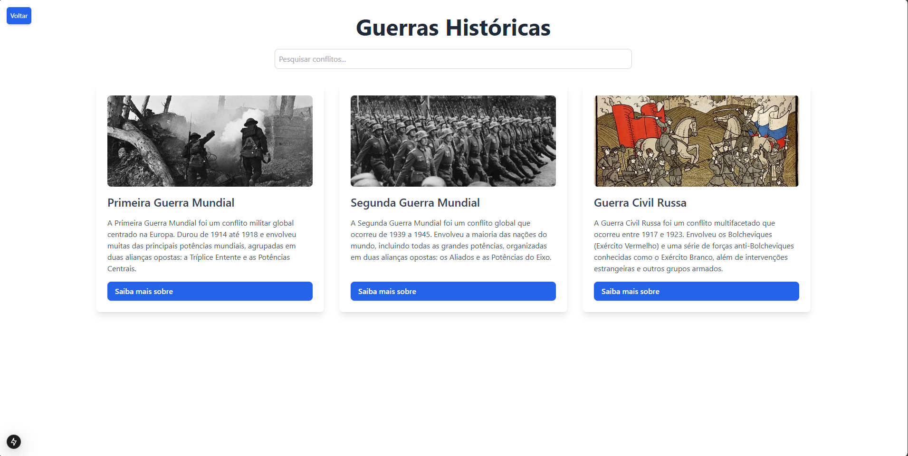
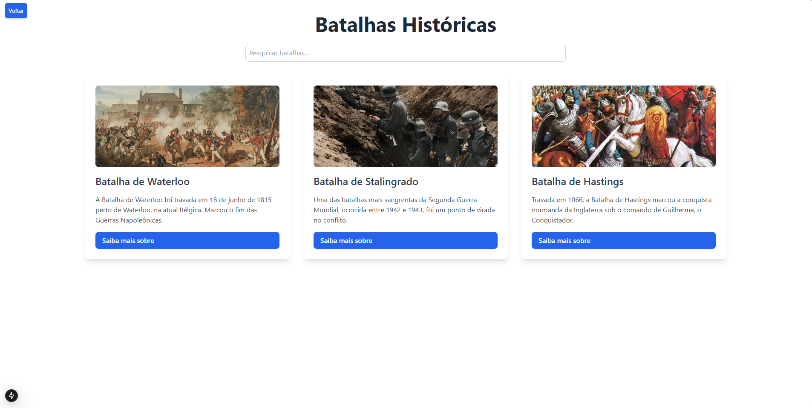
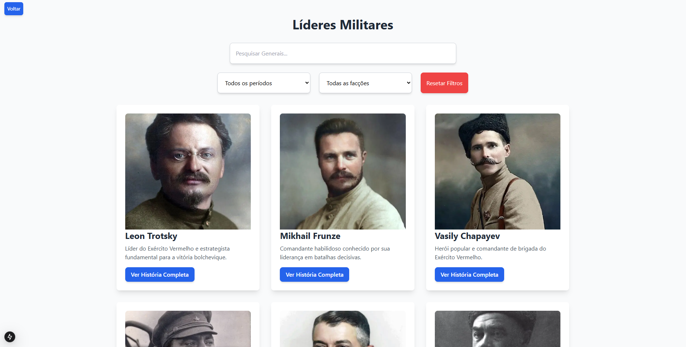

# História Militar

**História Militar** é uma aplicação desenvolvida com Next.js que funciona como uma enciclopédia online, focada exclusivamente em temas militares. A plataforma permite explorar eventos históricos, biografias de líderes militares, estratégias de batalhas e muito mais, com uma interface intuitiva e responsiva.

## 📄 Funcionalidades

- 📚 **Artigos Detalhados**: Informativos sobre guerras, batalhas, armamentos e figuras históricas.
- 🔍 **Sistema de Pesquisa**: Busque conteúdos específicos com facilidade.
- 🔄 **Navegação Intuitiva**: Interface amigável com design responsivo.
- 📊 **Organização por Categorias**: Filtre por período histórico, região ou tipo de conflito.

## 🚀 Tecnologias Utilizadas

- [Next.js](https://nextjs.org/)
- [React](https://reactjs.org/)
- [Tailwind CSS](https://tailwindcss.com/)
- [TypeScript](https://www.typescriptlang.org/) 

## 💡 Como Rodar o Projeto

1. **Clone o repositório:**

   ```bash
   git clone https://github.com/viniciusfelixmatos/historia-militar.git
   cd historia-militar
   ```

2. **Instale as dependências:**

   ```bash
   npm install
   # ou
   yarn install
   ```

3. **Inicie o servidor de desenvolvimento:**

   ```bash
   npm run dev
   # ou
   yarn dev
   ```

4. **Acesse no navegador:**

   Abra [http://localhost:3000](http://localhost:3000) para ver o projeto rodando.

## 📷 Capturas de Tela

### 🏠 Página Inicial

*A primeira página que os usuários visualizam ao acessar o site, oferecendo uma visão geral do conteúdo disponível e facilitando a navegação.*

### ⚔️ Página de Guerras

*Seção dedicada a grandes guerras da história, detalhando suas causas, consequências e principais eventos.*

### 🏹 Página de Batalhas Históricas

*Explore batalhas icônicas, estratégias utilizadas e seus impactos nos conflitos em que ocorreram.*

### 🎖️ Página de Líderes Militares

*Perfis de líderes militares influentes, analisando suas táticas, campanhas e legados históricos.*

## 📥 Deploy

Este projeto pode ser facilmente implantado usando o [Vercel](https://vercel.com/), que é otimizado para aplicações Next.js.

1. Faça login no Vercel.
2. Clique em **Importar Projeto**.
3. Selecione o repositório do GitHub.
4. Siga as instruções para concluir o deploy.

## 🛠️ Scripts Disponíveis

- `npm run dev`: Inicia o servidor de desenvolvimento.
- `npm run build`: Cria a versão de produção do projeto.
- `npm start`: Inicia o servidor no modo produção após o build.
- `npm run lint`: Executa o linter para verificar problemas de código.

## 🌐 Contribuições

Contribuições são bem-vindas! Para contribuir:

1. Fork o repositório.
2. Crie uma branch: `git checkout -b minha-contribuicao`
3. Faça suas alterações.
4. Envie o pull request.

## 📄 Licença

Este projeto está licenciado sob a [MIT License](LICENSE).

---

Desenvolvido por Vinicius Matos.